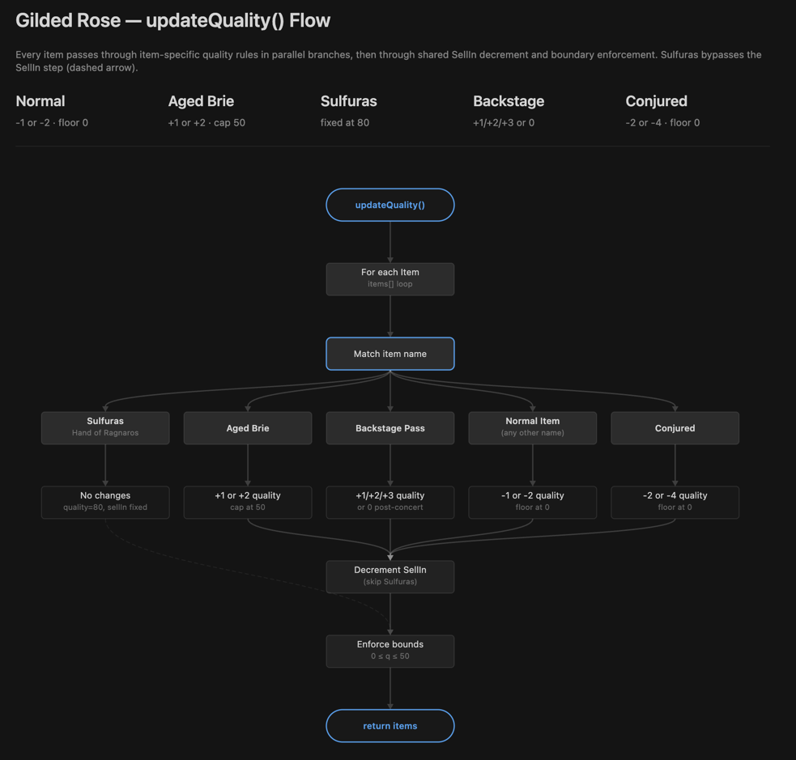
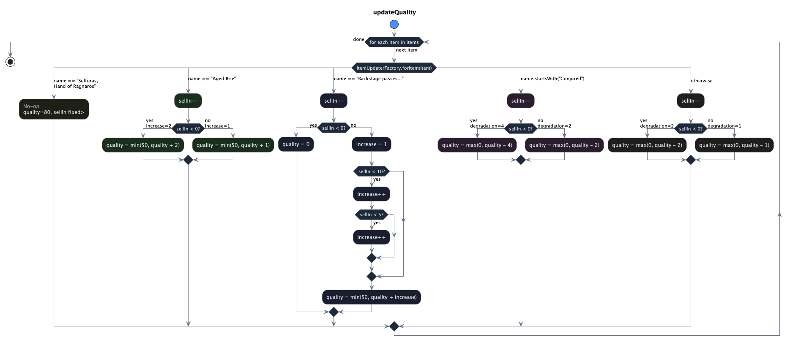

# Gilded Rose — Java Implementation Architecture

> **Last updated:** May 2026

---

## Table of Contents

1. [Overview](#1-overview)
2. [Module & Package Structure](#2-module--package-structure)
3. [Domain Model](#3-domain-model)
4. [Design Pattern — Strategy](#4-design-pattern--strategy)
5. [Class Responsibilities](#5-class-responsibilities)
6. [Update Flow](#6-update-flow)
7. [Quality Rules per Item Type](#7-quality-rules-per-item-type)
8. [Factory Configuration — Environment & System Properties](#8-factory-configuration--environment--system-properties)
9. [Test Architecture](#9-test-architecture)
10. [Extension Points](#10-extension-points)
11. [Constraints & Known Limitations](#11-constraints--known-limitations)

---

## 1. Overview

The Gilded Rose is an inventory management system for an inn that sells goods whose quality
changes daily according to business rules. The original implementation used a single
monolithic `if/else` chain inside `updateQuality()`. The current refactored design replaces
that with the **Strategy pattern**, isolating each item's update logic into a dedicated class
and routing through a factory.

**Core responsibility:** Given a list of `Item` objects, decrement each item by one day and
apply the correct quality adjustment rule for that item's type.

---

## 2. Module & Package Structure

```
Java/
├── src/
│   ├── main/java/com/gildedrose/
│   │   ├── Item.java                  # Legacy domain object (immutable contract)
│   │   ├── GildedRose.java            # Application entry point / orchestrator
│   │   ├── ItemUpdater.java           # Strategy interface
│   │   ├── ItemUpdaterFactory.java    # Strategy resolver + configurable name mapping
│   │   └── strategy/
│   │       ├── NormalItemUpdater.java     # Strategy: default degradation
│   │       ├── AgedBrieUpdater.java       # Strategy: quality increases with age
│   │       ├── SulfurasUpdater.java       # Strategy: legendary item, no changes
│   │       ├── BackstagePassUpdater.java  # Strategy: tiered increase, drops to 0 post-concert
│   │       └── ConjuredItemUpdater.java   # Strategy: double degradation
│   └── test/java/com/gildedrose/
│       ├── GildedRoseTest.java        # Behaviour-driven, nested test suite
│       └── TexttestFixture.java       # Approval / golden-master test harness
├── docs/
│   ├── Architecture.md                # This document
│   ├── gilded-rose-flow.png           # High-level updateQuality() flow diagram
│   ├── gilded-rose-flow-diagram.png   # Detailed per-branch activity diagram
│   └── gilded-rose-kata-flow.puml     # PlantUML source for the activity diagram
└── build.gradle
```

---

## 3. Domain Model

```
┌──────────────────────────────┐
│           Item               │  ← Legacy class. Must NOT be modified.
│──────────────────────────────│
│  + name    : String          │
│  + sellIn  : int             │
│  + quality : int             │
│──────────────────────────────│
│  + toString() : String       │
└──────────────────────────────┘
```

`Item` is a plain data holder with public mutable fields. It is owned by a "goblin"
constraint in the kata — no inheritance, no interface extraction, no field encapsulation is
permitted on this class.

**Invariants enforced by updaters (never by Item itself):**

| Invariant | Rule |
|-----------|------|
| Quality floor | `quality >= 0` for all non-legendary items |
| Quality ceiling | `quality <= 50` for all non-legendary items |
| Sulfuras quality | always `80`, never changes |
| Sulfuras sellIn | never decrements |

---

## 4. Design Pattern — Strategy

```
                    ┌─────────────────┐
                    │   GildedRose    │
                    │─────────────────│
                    │ items: Item[]   │
                    │─────────────────│
                    │ updateQuality() │──── for each item ────►  ItemUpdaterFactory
                    └─────────────────┘                               │
                                                                       │ forItem(item)
                                                    ┌──────────────────┴──────────────────┐
                                                    │          «interface»                 │
                                                    │          ItemUpdater                 │
                                                    │──────────────────────────────────────│
                                                    │  + update(Item) : void               │
                                                    └──────┬───────┬────────┬──────┬───────┘
                                                           │       │        │      │
                                               ┌───────────┘  ┌───┘  ┌─────┘  ┌───┘
                                               │              │      │        │
                                        Normal  Aged Brie  Sulfuras  Backstage  Conjured
                                        Updater  Updater   Updater    Updater   Updater
```

Each `ItemUpdater` implementation is a **stateless strategy**. `ItemUpdaterFactory` acts as
the context that selects the correct strategy based on the item's name at runtime.

---

## 5. Class Responsibilities

### `GildedRose`
- Orchestrator. Holds the `Item[]` array.
- Iterates items and delegates each update to the factory + strategy.
- Contains no business logic itself.

### `ItemUpdater` _(interface)_
- Single-method strategy contract: `void update(Item item)`.
- All business logic lives behind this interface.

### `ItemUpdaterFactory`
- **Strategy resolver.** Maps an item's name to the correct `ItemUpdater`.
- Item names are **configurable** at startup via system properties or environment variables
  (see [Section 8](#8-factory-configuration--environment--system-properties)).
- Falls back to hardcoded default names when no configuration is present.

### `NormalItemUpdater`
- Decrements `sellIn` by 1.
- Degrades quality by 1 before sell date, by 2 on/after sell date. Floor: 0.

### `AgedBrieUpdater`
- Decrements `sellIn` by 1.
- Increases quality by 1 before sell date, by 2 on/after sell date. Ceiling: 50.

### `SulfurasUpdater`
- No-op. Neither `sellIn` nor `quality` are ever modified.

### `BackstagePassUpdater`
- Decrements `sellIn` by 1.
- Quality increases: +1 (>10 days), +2 (≤10 days), +3 (≤5 days).
- Drops to 0 when the concert date has passed (`sellIn < 0`). Ceiling: 50.

### `ConjuredItemUpdater`
- Decrements `sellIn` by 1.
- Degrades quality by 2 before sell date, by 4 on/after sell date. Floor: 0.

---

## 6. Update Flow

### High-level flow



The diagram above shows `updateQuality()` iterating over all items, dispatching through
`ItemUpdaterFactory`, and routing each item to the appropriate strategy branch.

### Detailed per-branch activity



This diagram shows every decision node inside each strategy — `sellIn` thresholds, quality
increment/decrement amounts, and boundary clamping.

---

## 7. Quality Rules per Item Type

| Item Type | Match Condition | sellIn | Quality Δ (before sell) | Quality Δ (after sell) | Bounds |
|-----------|-----------------|--------|------------------------|------------------------|--------|
| **Normal** | any other name | −1/day | −1 | −2 | [0, 50] |
| **Aged Brie** | `name == "Aged Brie"` | −1/day | +1 | +2 | [0, 50] |
| **Sulfuras** | `name == "Sulfuras, Hand of Ragnaros"` | none | 0 | 0 | fixed at 80 |
| **Backstage Pass** | `name == "Backstage passes to a TAFKAL80ETC concert"` | −1/day | +1 / +2 / +3 | drops to 0 | [0, 50] |
| **Conjured** | `name.startsWith("Conjured")` | −1/day | −2 | −4 | [0, 50] |

> "After sell" means `sellIn < 0` — i.e., the day _after_ the sell-by date.
> Backstage pass tiers: `sellIn > 10` → +1 · `sellIn ∈ [5,10]` → +2 · `sellIn ∈ [0,4]` → +3

---

## 8. Factory Configuration — Environment & System Properties

`ItemUpdaterFactory` resolves each item-type name at class-loading time using a three-level
fallback:

```
Priority 1 → JVM system property   (e.g.  -Dgilded.rose.sulfuras="My Sulfuras")
Priority 2 → Environment variable  (e.g.  GILDED_ROSE_SULFURAS="My Sulfuras")
Priority 3 → Hardcoded default     (original kata name)
```

| Item Type | System Property | Environment Variable | Default Value |
|-----------|-----------------|----------------------|---------------|
| Sulfuras | `gilded.rose.sulfuras` | `GILDED_ROSE_SULFURAS` | `Sulfuras, Hand of Ragnaros` |
| Aged Brie | `gilded.rose.aged-brie` | `GILDED_ROSE_AGED_BRIE` | `Aged Brie` |
| Backstage Pass | `gilded.rose.backstage-pass` | `GILDED_ROSE_BACKSTAGE_PASS` | `Backstage passes to a TAFKAL80ETC concert` |
| Conjured prefix | `gilded.rose.conjured-prefix` | `GILDED_ROSE_CONJURED_PREFIX` | `Conjured` |

**Motivation:** The kata hardcodes item names as magic strings. In a real deployment, item
names may differ per locale or tenant. This mechanism allows runtime configuration without
recompilation, while keeping the default behaviour identical to the original spec.

**Conjured matching** uses `startsWith(prefix)` rather than exact equality, so any item
whose name begins with the configured prefix (default `"Conjured"`) is treated as conjured.

---

## 9. Test Architecture

Tests live in `GildedRoseTest` and are organised with JUnit 5 `@Nested` classes — one inner
class per item type, plus a cross-cutting `GlobalInvariants` class.

```
GildedRoseTest
├── NormalItem          — 7 tests: quality/sellIn decrement, floor boundary
├── AgedBrie            — 6 tests: quality increment, ceiling boundary
├── Sulfuras            — 3 tests: no-op invariants
├── BackstagePasses     — 8 tests (parametrised): tier boundaries, ceiling, post-concert drop
├── ConjuredItems       — 7 tests: double-degradation, floor boundary
└── GlobalInvariants    — 3 tests: quality never negative, never > 50, multi-item pass
```

**Design choices:**

- `@ParameterizedTest` + `@CsvSource` for boundary value analysis (e.g., sellIn = 10, 9, 6
  for the +2 backstage tier).
- Helper method `update(name, sellIn, quality)` creates a single-item shop, runs one day,
  and returns the item — removes ceremony from every test.
- Tests verify **observable output** (quality, sellIn values) only. No mocking required
  because all strategies are pure functions over `Item`.

---

## 10. Extension Points

To add a new item type:

1. Create `XxxUpdater implements ItemUpdater` in the `strategy` package with the quality rule.
2. Add a name constant and resolution call in `ItemUpdaterFactory`.
3. Add a `case` arm in the `switch` expression inside `ItemUpdaterFactory.forItem()`.
4. Add a `@Nested` test class in `GildedRoseTest`.

No existing class needs modification beyond the factory — open/closed principle is respected
for strategy implementations.

---

## 11. Constraints & Known Limitations

| Constraint | Detail |
|------------|--------|
| `Item` is locked | Public mutable fields; no encapsulation. Cannot add methods or implement interfaces. |
| Name-based dispatch | Routing relies on string matching, not type hierarchy. Adding a new item requires a factory change. |
| Static factory | `ItemUpdaterFactory.forItem()` is a static method. Replacing strategies (e.g., for testing) requires subclassing or a different wiring approach. |
| Class-load-time config | Names are resolved once at class loading. Changing env vars at runtime has no effect without JVM restart. |
| No persistence | The system operates purely in memory; there is no database or file I/O in the core domain. |
